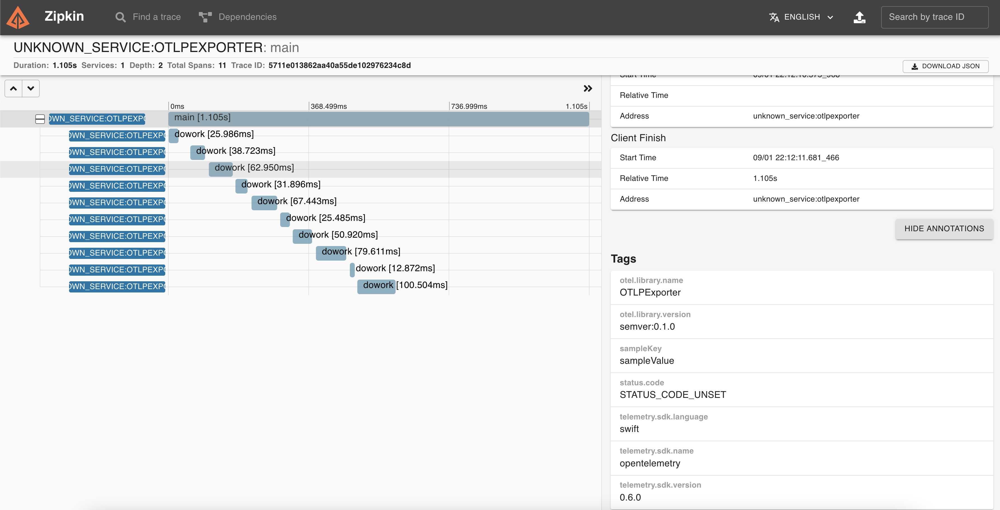
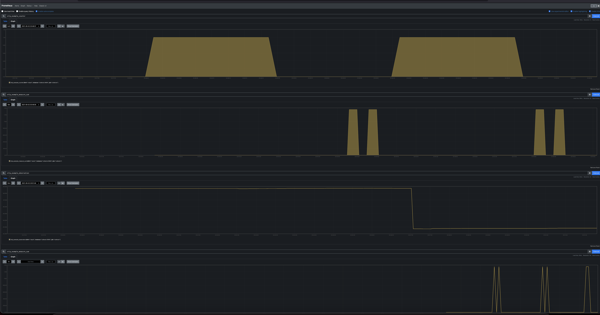

### OTLP Exporter Example

This example shows how to use [OTLP Exporter](https://github.com/open-telemetry/opentelemetry-swift/tree/main/Sources/Exporters/OpenTelemetryProtocol) to instrument a simple Swift application.

This example will export spans data simultaneously using [OTLP Exporter ](https://github.com/open-telemetry/opentelemetry-swift/tree/main/Sources/Exporters/OpenTelemetryProtocol) and grpc. It will use [proto format](https://github.com/open-telemetry/opentelemetry-proto).


## Run the Application

1. Run docker: This will start otel-collector, Zipkin and Prometheus

    ```shell script
    # from this directory
    docker-compose up
    ```

2. Run  app

    ```shell script
    # from this directory
    swift run OTLPExporter
    ```

3. Teardown the docker images

    ```shell script
    # from this directory
    docker-compose down
    ```

4. Open page at <http://localhost:9411/zipkin/> -  you should be able to see the spans in zipkin


### Prometheus UI

The prometheus client will be available at <http://localhost:9090>.

Note: It may take some time for the application metrics to appear on the Prometheus dashboard.


5. If you don't set service.name as per https://github.com/open-telemetry/opentelemetry-specification/blob/main/specification/sdk-environment-variables.md the default name of the service and spans generate by the OTLP Exporter is `unknown_service:otlpexporter` You can either set the service.name by editing the schema in Xcode and the set the environment variable for OTEL_RESOURCE_ATTRIBUTES, or set it via command line:

    ```shell script
    # from this directory
    OTEL_RESOURCE_ATTRIBUTES="service.name=my-swift-app,service.version=v1.2.3" swift run OTLPExporter
    ```
This will create a service and spans with the name `my-swift-app`

## Connect with TLS

The checked-in example uses plaintext so it can connect to the local collector from the Docker
setup above. To connect to a TLS-enabled collector, update the collector settings in `main.swift`:

```swift
let collectorHost = "collector.example.com"
let collectorPort = 4317
let collectorTransport = CollectorTransport.tls
```

The TLS configuration uses the platform's default trust roots and performs full certificate
verification. The value of `collectorHost` must match a name or address covered by the collector
certificate.

## Useful links

- For more information on OpenTelemetry, visit: <https://opentelemetry.io/>
- For more information on trace, visit: <https://github.com/open-telemetry/opentelemetry-swift/tree/main/Sources/OpenTelemetrySdk/Trace>
- For more information on metrics, visit: <https://github.com/open-telemetry/opentelemetry-swift/tree/main/Sources/OpenTelemetrySdk/Metrics>

## LICENSE

Apache License 2.0
